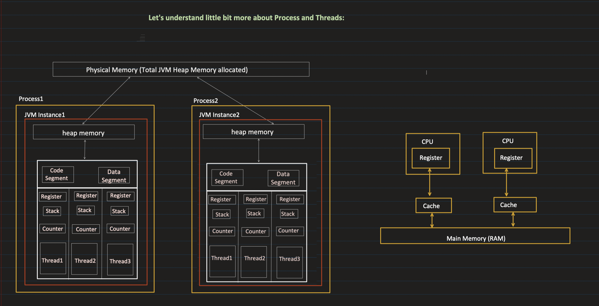
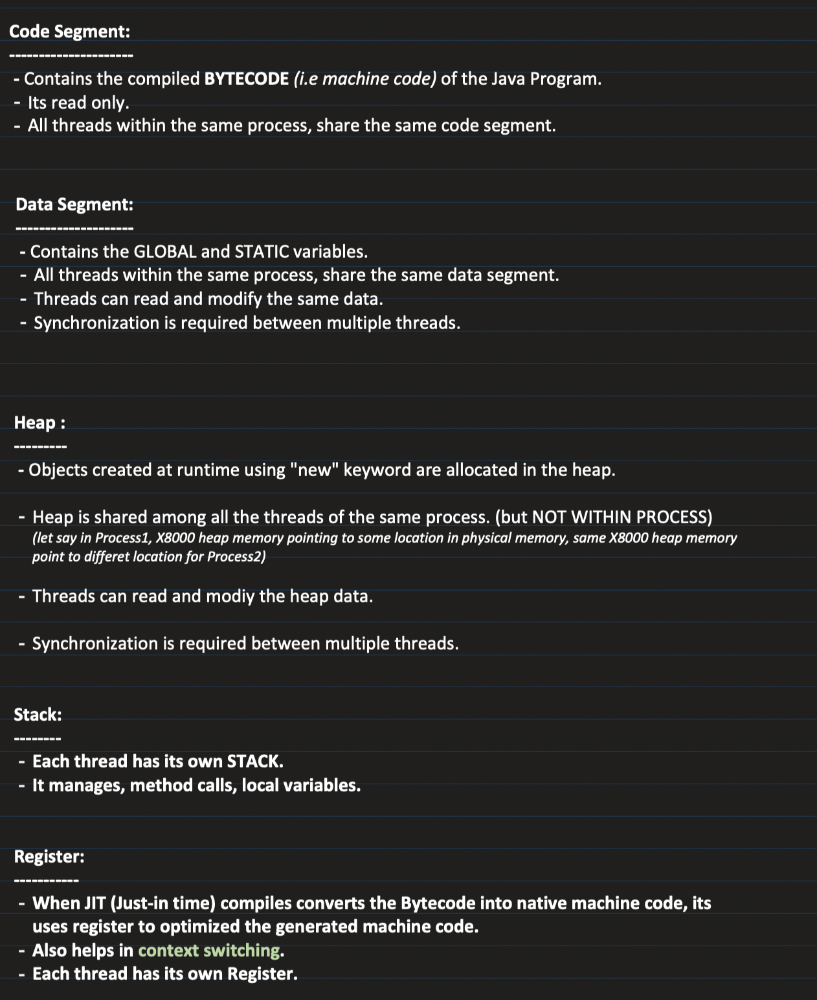

## Threads vs Processes

#### What is a Program ?
- A program is an executable file.
- It contains code/ set of instructions that is stored as a file on a disk.
- When the code in the program is loaded into the memory and executed by the processor then it becomes a process.

#### Processes
- A process is an instance of a program in execution. 
- It is a self-contained unit of execution that has its own address space, code, data, and system resources.
- A process provides an isolated environment for the execution of a program, ensuring that one process does not interfere with another. (example : google chrome : tabs = independent processes )

#### Threads
- A thread, also known as a lightweight process, is the smallest unit of execution within a process. (smallest unit of processing)
- A thread shares the process's resources, such as memory and file handles, but has its own execution context, including the program counter, register values, and stack.
- Threads are independent , if any __exception__ occurs in one thread, it does not affect other threads.
 

When a process is created , it starts with 1 thread : main thread , from this thread we can create multiple threads to perform task concurrently.  
 

#### Relationship
**Multithreading**: A single process can contain multiple threads, all running concurrently within the same address space. Multithreading allows a process to perform multiple tasks simultaneously, improving the efficiency and responsiveness of applications.

**Resource Sharing**: Threads within the same process share the process's resources, making inter-thread communication and data sharing more efficient than inter-process communication. However, this shared access requires synchronization mechanisms to ensure data consistency and prevent race conditions.

**Isolation vs. Efficiency:** Processes provide isolation between different executing programs, while threads provide a way to divide a single program into multiple concurrent execution paths. Using threads within a process is more efficient than using multiple processes, as threads have lower overhead in terms of memory and resource allocation.

**Independence**: While threads share the same process resources, they can execute independently of each other. This independence is crucial for concurrent execution and for exploiting parallelism on multi-core processors.