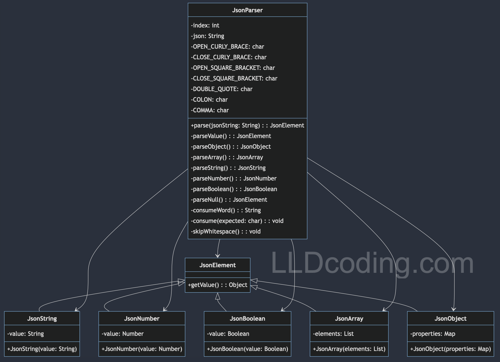

# JSON PARSER

### Features Required
Features Required:
1. Parse JSON: Read and interpret JSON data.
2. Handle Different Types: Support various data types (string, number, boolean, array, object, null).
3. Error Handling: Gracefully handle syntax errors and unexpected input.
4. Nested Structures: Support nested JSON structures.
5. Flexible Parsing: Allow parsing of partial JSON data.
6. Object Mapping: Convert JSON data into a usable object structure.
7. Configurability: Allow configuration for handling specific JSON structures.

## Solution
- Design Patterns Involved
  - Interpreter Pattern: For parsing JSON syntax. 
  - Composite Pattern: For handling nested structures. 
  - Factory Method Pattern: To create different types of JSON elements. 
  - Builder Pattern: Construct complex JSON objects step by step. 
  - Strategy Pattern: Different strategies for parsing different types of JSON elements.

