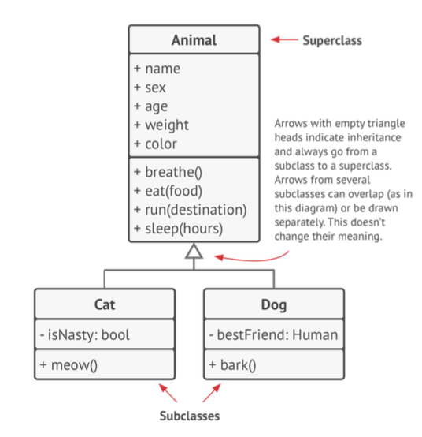
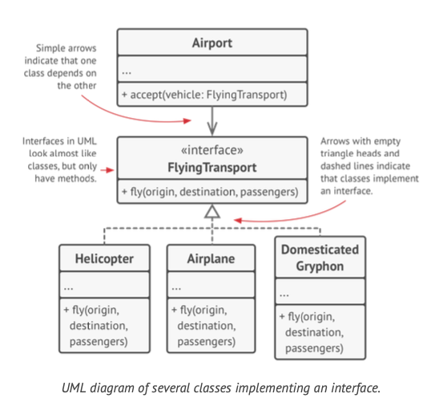
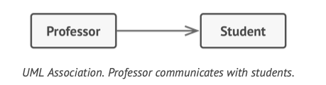
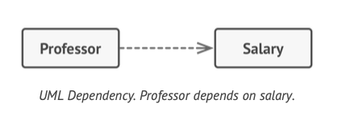
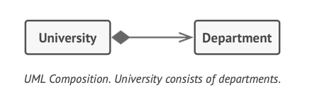
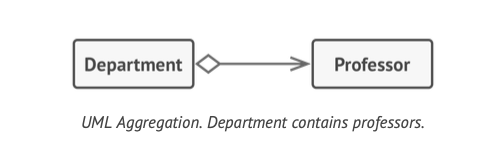

## UML

### inheritance (is - a)
- 

### implementation
- 

### Association (uses - a)
- one object uses or interacts with another.
- 

### Dependency (uses)
- weaker variant of association [no permanent link]
- Typically implies: an object accepts another object as method param, instantiates or uses another object.
- 

### Composition (has - a)
- whole part relationship 
- one is composed of one/more instances of other objects.
- if the whole is destoryed the parts are also destroyed.
- 

### Aggregation (has - a)
- less strict than composition.
- one object early contains a reference to another.
- the component can exists without the container & can be linked with several containers
- 