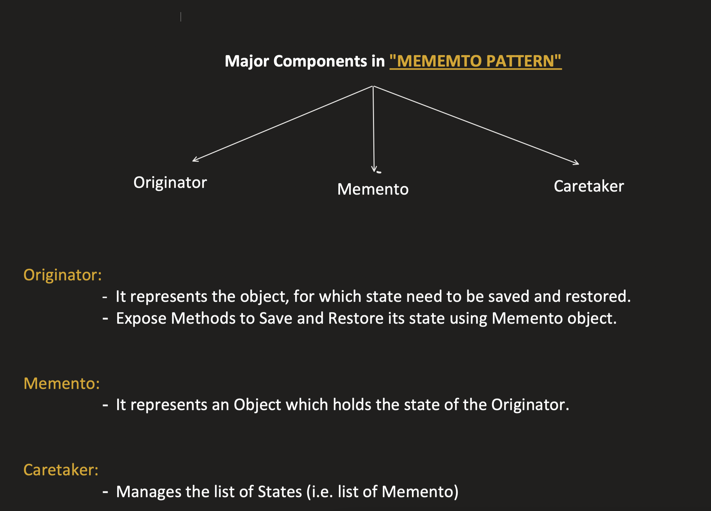
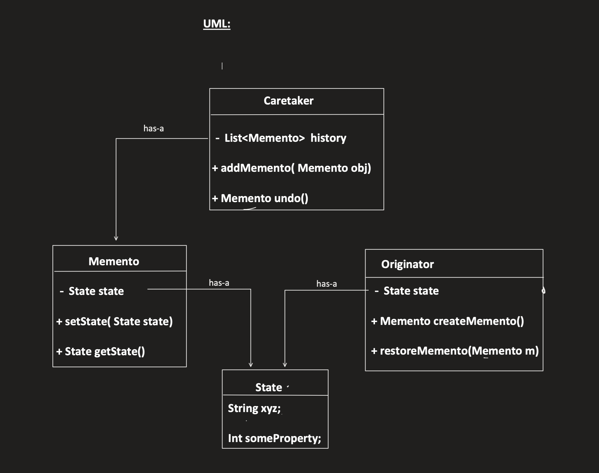
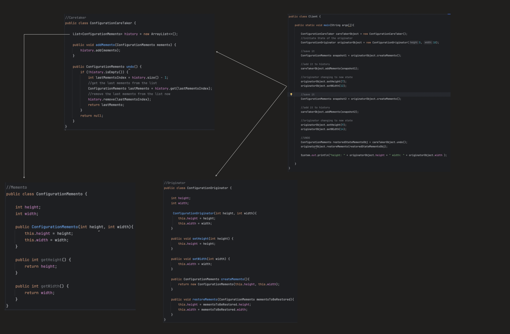

## Memento / Snapshot Design Pattern

### Where to use :
- It provides ability to ___revert___ an object to its ___previous___ state i.e. <u> UNDO functionality</u>
- It does not expose the internal implementation of an object.
  - as the object params are made pvt & if made public : unsafe
- Memento is a behavioral design pattern that lets you save and restore the previous state of an object without revealing the details of its implementation.

### Interview Problems:
- Take a snapshot of a particular state :: so we can undo

### Design Pattern  

## Code
