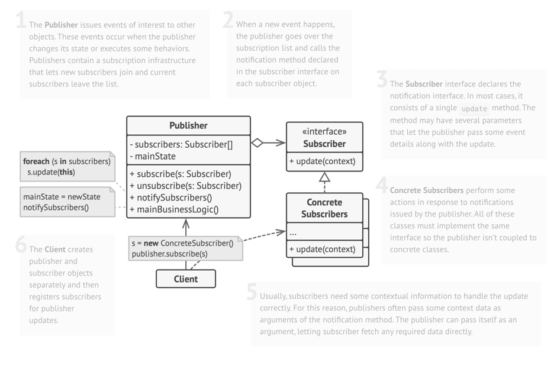
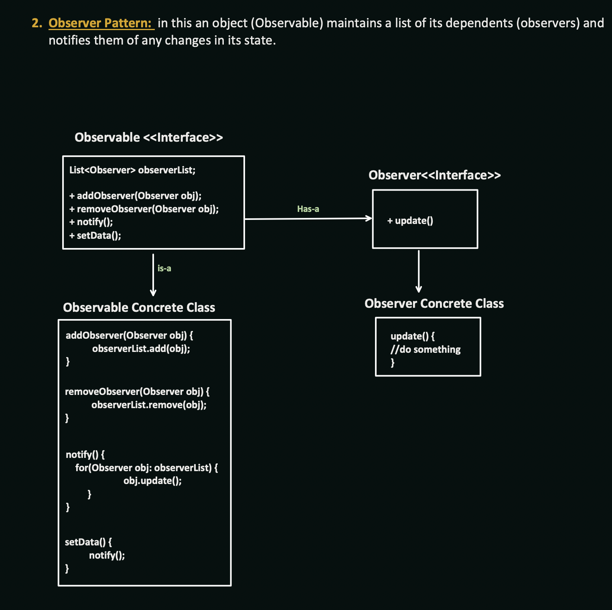

## Observer Design Pattern

### Question
- Notify me if the product is Out of Stock

### Structure
  
When ever there is a stage change in the observable then all the observes will get notified by it  

  

#### Generalized Examples :
- Weather Station is the Observable :
  - observers : TV Display , Mobile Display