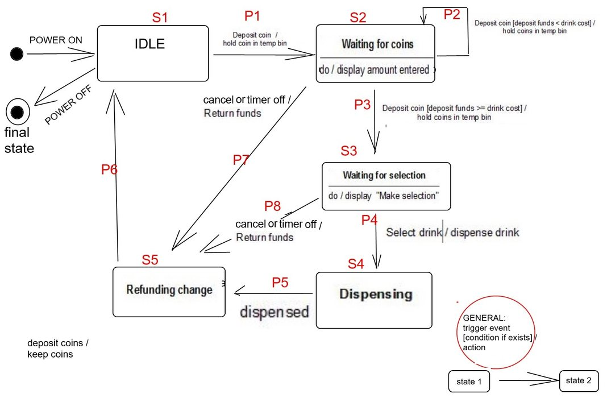
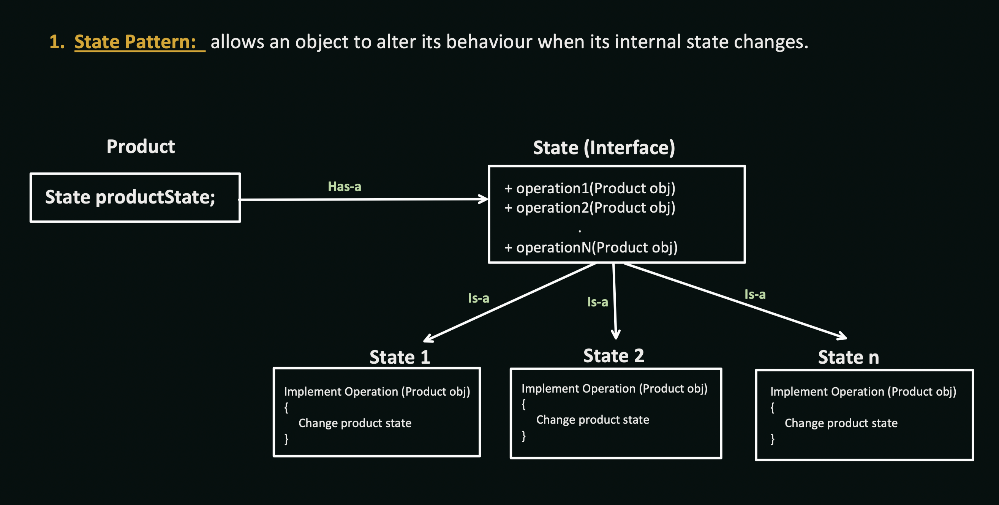
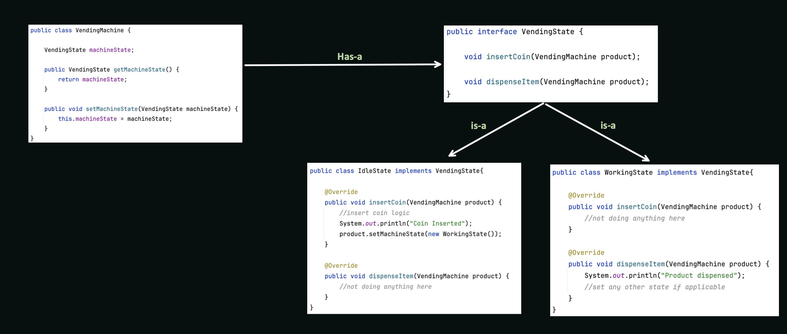

## State Design Pattern 

### _Observation_
- If in different states of the system : it only has some specific operations which are allowed
to preform.
    - state wise operations
- Ex: Design TV
  - State :: Operations
  - Off :: On Button(I can only press ON button) 
  - On :: Change Channel , Change Volume, Off Button
- Vending Machine : Flow Diagram
  
    - State :: Operations look for them here  

