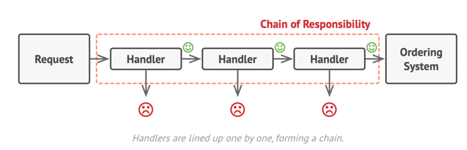
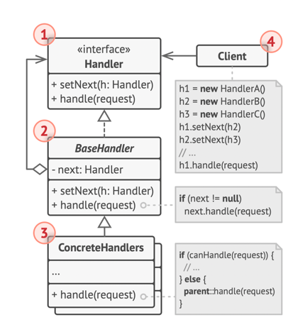

## Chain of responsibility

### Questions:
- Design ATM / Vending Machine
- Design Logger

Suppose a sender sent a request, and it has to 
pass through various/multiple receivers 

**a handler can decide not to pass the request further down the chain and effectively stop any further processing.**

example : 
__Vending Machine__ : here the client requests the 2000Rs from the Machine,
the Machine has __Handlers__ as 2000RsHandler, 1000RsHandler , 500RsHandler , 100RsHandler
now the request will pass in the series and the machine will try to fulfill the request , __if at any point
the request is fulfilled__ it returns & don't pass it further.

### UML

- The Handler declares the interface, common for all concrete handlers. It usually contains just a single method for handling requests, but sometimes it may also have another method for setting the next handler on the chain.

- The Base Handler is an optional class where you can put the boilerplate code that’s common to all handler classes.

- Usually, this class defines a field for storing a reference to the next handler. The clients can build a chain by passing a handler to the constructor or setter of the previous handler. The class may also implement the default handling behavior: it can pass execution to the next handler after checking for its existence.

- Concrete Handlers contain the actual code for processing requests. Upon receiving a request, each handler must decide whether to process it and, additionally, whether to pass it along the chain.

- Handlers are usually self-contained and immutable, accepting all necessary data just once via the constructor.

- The Client may compose chains just once or compose them dynamically, depending on the application’s logic. Note that a request can be sent to any handler in the chain—it doesn’t have to be the first one.

## Pros & Cons 
- You can control the order of request handling.
- Single Responsibility Principle. You can decouple classes that invoke operations from classes that perform operations.
- Open/Closed Principle. You can introduce new handlers into the app without breaking the existing client code.
- **Cons** : Some requests may end up unhandled.