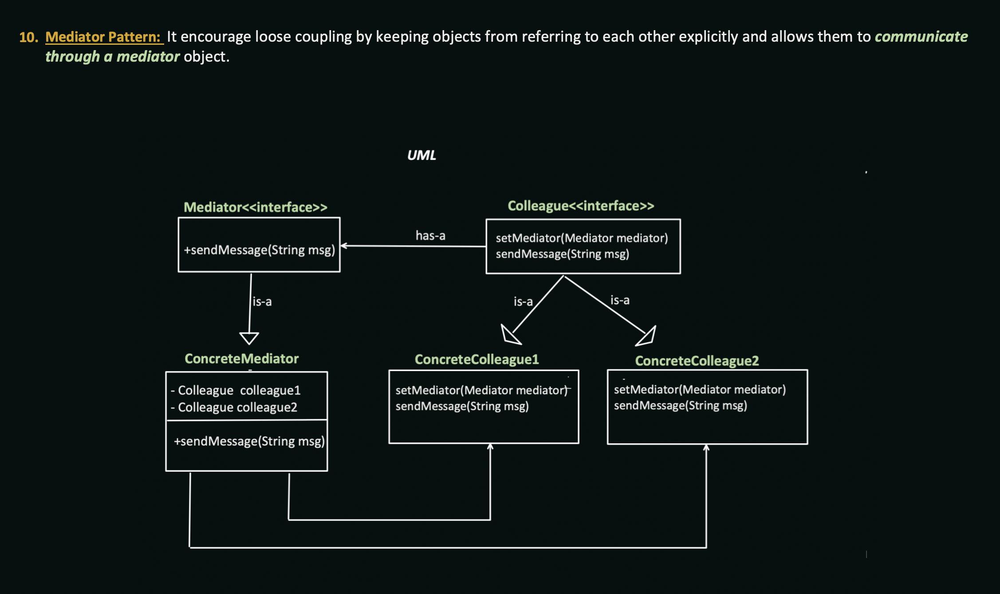

## Mediator Design Pattern

### Questions :
- <u>Online Auction System</u> : Here when a person bids then the other persons knows how much bid is placed by the auctioneer(**mediator**)
- <u>Design Airline Management System</u> : Pilots of aircraft that approach or depart the airport control area don’t communicate directly with each other. Instead, they speak to an air traffic controller (**mediator**)

### Design pattern:
- it encourages loose coupling by keeping objects from referring to each other explicitly & allows them to <u>__communicate
through a mediator object__</u>
- The pattern restricts direct communications between the objects and forces them to collaborate only via a mediator object.

UML :

### Differences :
- Observer vs 
- Proxy vs Mediator

## Pros & Cons
- Single Responsibility Principle. You can extract the communications between various components into a single place, making it easier to comprehend and maintain.
- Open/Closed Principle. You can introduce new mediators without having to change the actual components.
- You can reduce coupling between various components of a program.
- You can reuse individual components more easily.
- **_Cons :_** Over time a mediator can evolve into a _God Object_.

## Relations with other Patterns:
### Facade and Mediator have similar jobs: they try to organize collaboration between lots of tightly coupled classes.
- Facade defines a simplified interface to a subsystem of objects, but it doesn’t introduce any new functionality. The subsystem itself is unaware of the facade. Objects within the subsystem can communicate directly.
- Mediator centralizes communication between components of the system. The components only know about the mediator object and don’t communicate directly.

### Mediator vs Observer
