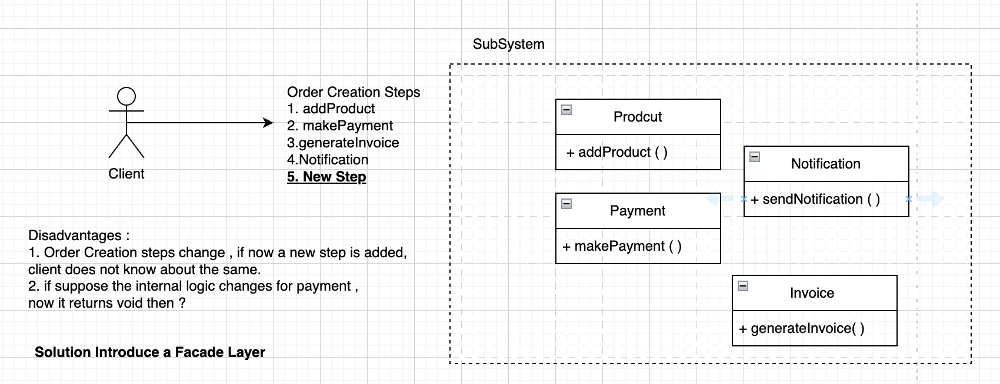

# Facade Design Pattern

## Where to use

- Whenever we have to hide the system complexity from the Client
  - eg : Car -> for a client , when it presses accelerates() -> speed inc
  - brake() -> speed decrease

## How facade works
- It comes in between the client and complex system
 Client => facade => complex system
- **Note** we are not forcing client to use facade, client can also interact with the system directly.

## Example
 __Scenario : 1__
- client using the EmployeeDAO : methods :: getEmployeeDetails , getEmployeeDetailByEmail , updateEmployeeName , etc
  - here we can hide the other tons of methods from the client

__Scenario : 2__

__Scenario : 3__
- facade interacting with facade 

## Facade vs Proxy
-

##  Facade vs Adapter
- Adapter is used to bring compability between the client & original interface.
- but Facade is used to hide the complexity.